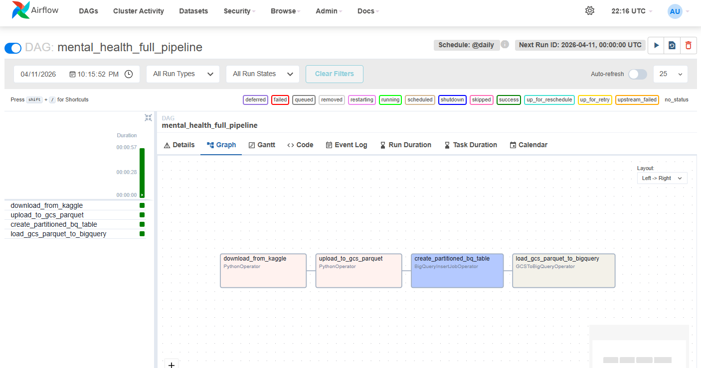
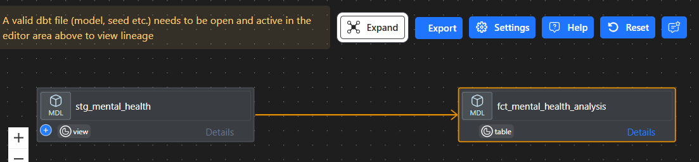
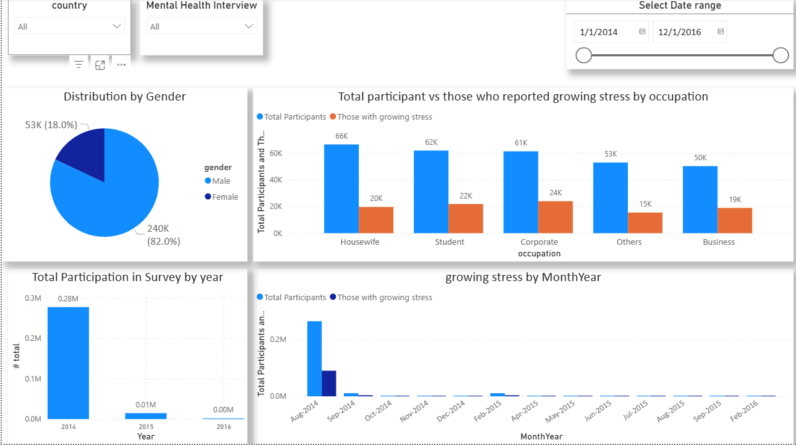

# Mental Health Data Pipeline Project

## Table of Contents
- [Objective](#objective)
- [Technologies Used](#technologies-used)
- [Problem Description](#problem-description)
- [Project Overview](#project-overview)
- [Architecture Overview](#architecture-overview)
- [Setup Instructions](#setup-instructions)
  - [GCP Project Configuration](#gcp-project-configuration)
  - [Terraform Deployment](#terraform-deployment)
  - [Docker Installation](#docker-installation)
  - [Spark Environment Setup](#spark-environment-setup)
  - [Apache Airflow Installation and Configuration](#apache-airflow-installation-and-configuration)
  - [dbt Core Setup and BigQuery Configuration](#dbt-core-setup-and-bigquery-configuration)
- [Airflow Pipeline Details](#airflow-pipeline-details)
  - [DAG Overview](#dag-overview)
  - [DAG Execution Flow](#dag-execution-flow)
- [dbt Transformation Details](#dbt-transformation-details)
  - [dbt Project Structure and Models](#dbt-project-structure-and-models)
  - [Running dbt Models](#running-dbt-models)
  - [Accessing Transformed Data](#accessing-transformed-data-in-bigquery)
- [Running the Complete Pipeline](#running-the-complete-pipeline)
  - [Step-by-Step Execution](#step-by-step-execution)
  - [Monitoring and Troubleshooting](#monitoring-and-troubleshooting)
- [Visualization in Power BI](#visualization-in-power-bi)
- [Next Steps](#next-steps)

## Objective
**Unlocking Insights into Mental Health: Building a Robust Data Pipeline for Global Analysis**

The primary objective of this project is to engineer an automated, end-to-end data intelligence pipeline that monitors and analyzes the global intersection of professional environments and mental health outcomes. By leveraging Airflow, PySpark, and Google Cloud Platform, the project transforms static global survey data into a dynamic analytical ecosystem. This system is designed to identify shifting trends in workplace stress, bridge the 'treatment gap' through predictive data modeling, and provide public health stakeholders with a real-time diagnostic tool to optimize workplace wellness and intervention strategies

## Technologies Used
This project leverages cutting-edge cloud and data engineering tools:

-  [Terraform](https://www.terraform.io/docs) - Infrastructure as Code
-  [Google Cloud Platform (GCP)](https://cloud.google.com/docs) - Cloud Services
-  [Apache Airflow](https://airflow.apache.org/docs/) - Workflow Orchestration
-  [Google BigQuery](https://cloud.google.com/bigquery/docs) - Data Warehouse
-  [dbt](https://docs.getdbt.com/) - Data Transformation
-  [Power BI](https://docs.microsoft.com/en-us/power-bi/) - Data Visualization

## Problem Description
This project utilizes the "Mental Health Dataset" from Kaggle, available [here](https://www.kaggle.com/datasets/divaniazzahra/mental-health-dataset). This open-source dataset provides a foundation for analyzing mental health patterns.

The goal is to construct a comprehensive data pipeline that ingests, processes, and visualizes mental health data, revealing insights across time, geography, and demographic variables to inform public health strategies.

## Project Overview
The project encompasses:

1. **Infrastructure Provisioning**: Deploy cloud resources using Terraform.
2. **Data Ingestion**: Load dataset into Google Cloud Storage (GCS).
3. **Data Transfer**: Move data from GCS to BigQuery via Airflow.
4. **Data Transformation**: Process data in BigQuery using dbt.
5. **Visualization**: Create dashboards in Power BI.

All development occurs within a GCP Virtual Machine for consistency.

## Architecture Overview

This project implements a modern data engineering pipeline with three key stages:

```
┌─────────────────────────────────────────────────────────────────┐
│                     DATA PIPELINE ARCHITECTURE                  │
└─────────────────────────────────────────────────────────────────┘

STAGE 1: INFRASTRUCTURE (Terraform)
┌──────────────────────────────────────────────────────────────────┐
│  Google Cloud Platform                                           │
│  ├── GCS Bucket (data lake)         - Stores raw/processed data │
│  ├── BigQuery Dataset               - Data warehouse            │
│  └── Compute Instance (n2-std-4)    - Runs Spark & Airflow     │
└──────────────────────────────────────────────────────────────────┘
                              ↓
STAGE 2: ORCHESTRATION & INGESTION (Apache Airflow)
┌──────────────────────────────────────────────────────────────────┐
│  Airflow DAGs (Running in Docker)                               │
│  ├── kaggle_ingestion_dag                                       │
│  │   ├── Download from Kaggle                                   │
│  │   └── Verify data integrity                                  │
│  │                                                               │
│  ├── gcp_upload_dag (Full Pipeline)                            │
│  │   ├── Download from Kaggle                                   │
│  │   ├── Upload to GCS (via PySpark)                           │
│  │   └── Transfer GCS → BigQuery                                │
│  │                                                               │
│  └── gcs_to_bigquery_dag (Optional)                            │
│      └── Direct GCS → BigQuery transfer                        │
└──────────────────────────────────────────────────────────────────┘
                              ↓
STAGE 3: TRANSFORMATION & ANALYTICS (dbt)
┌──────────────────────────────────────────────────────────────────┐
│  dbt Models & Transformations                                    │
│  ├── Staging Layer (Views)                                      │
│  │   └── stg_mental_health: Clean & standardize raw data       │
│  │                                                               │
│  └── Mart Layer (Tables)                                        │
│      └── fct_mental_health_analysis: Analytical fact table     │
└──────────────────────────────────────────────────────────────────┘
                              ↓
STAGE 4: VISUALIZATION
┌──────────────────────────────────────────────────────────────────┐
│  Power BI Dashboards                                             │
│  └── Connected to dbt fact tables in BigQuery                   │
└──────────────────────────────────────────────────────────────────┘
```

**Key Technologies**:
- **Infrastructure**: Terraform + GCP
- **Orchestration**: Apache Airflow (Docker)
- **Processing**: PySpark + Spark 3.5.0
- **Storage**: Google Cloud Storage (GCS) + BigQuery
- **Transformation**: dbt (data build tool)
- **Visualization**: Power BI


### GCP Project Configuration
1. Create a new project in the [Google Cloud Console](https://console.cloud.google.com/).
2. Navigate to **IAM & Admin > Service Accounts** and create a new service account.
3. Generate a JSON key for the service account and download it.
4. Save the key file as `teraform-mar-0fb97fcd6586.json` in the `keys/` directory.

#### Enable APIs and Assign Roles
- Enable the **Compute Engine API**: Go to "APIs & Services" > "Library," search for "Compute Engine API," and enable it.
- Under **IAM & Admin > IAM**, assign these roles to the service account:
  - Viewer
  - Storage Admin
  - Storage Object Admin
  - BigQuery Admin
  - Compute Admin

#### SSH Key Setup
1. Generate an SSH key pair:
   ```bash
   ssh-keygen -t rsa -f ~/.ssh/KEY_FILENAME -C USERNAME -b 2048
   ```
2. Copy the public key content and paste it into **Compute Engine > Metadata > SSH Keys**.

### Terraform Deployment
Terraform automates the creation of essential cloud infrastructure. This section provides step-by-step guidance for beginners to replicate the setup.

#### Prerequisites
- Install [Terraform](https://www.terraform.io/downloads) on your local machine.
- Ensure GCP credentials are configured as above.

#### Infrastructure Components
The Terraform configuration deploys:
- **Google Cloud Storage (GCS) Bucket**: For data lake storage with automatic cleanup of incomplete uploads after 1 day.
- **BigQuery Dataset**: Named `Mar_Mental_Health_Big_Data_Project` for data warehousing.
- **GCP Virtual Machine**: An `n2-standard-4` instance in `us-central1-a` with Debian 11, tagged for the project, and equipped with a local SSD for performance.

#### Step-by-Step Deployment
1. **Navigate to the Terraform Directory**:
   ```bash
   cd Terraform/
   ```

2. **Initialize Terraform**:
   ```bash
   terraform init
   ```
   This downloads necessary providers and sets up the working directory.

3. **Review the Plan** (Optional but Recommended):
   ```bash
   terraform plan
   ```
   This shows what resources will be created without applying changes.

4. **Apply the Configuration**:
   ```bash
   terraform apply
   ```
   - Review the proposed changes and type `yes` to confirm.
   - Terraform will create the GCS bucket, BigQuery dataset, and VM instance.

5. **Verify Resources**:
   - Check the [GCP Console](https://console.cloud.google.com/) for the new bucket, dataset, and VM.

#### Connecting to the Virtual Machine
After deployment:
1. Go to **Compute Engine > VM instances** in the GCP Console.
2. Note the **External IP** of the `mental-health-vm` instance.
3. Connect via SSH:
   ```bash
   ssh -i ~/.ssh/KEY_FILENAME USERNAME@EXTERNAL_IP
   ```
   Replace `KEY_FILENAME` and `USERNAME` with your values.

4. **Optional: Configure SSH Config** for easier access. Add to `~/.ssh/config`:
   ```bash
   Host mental-health-vm
       HostName EXTERNAL_IP
       User USERNAME
       IdentityFile ~/.ssh/KEY_FILENAME
   ```
   Then connect with:
   ```bash
   ssh mental-health-vm
   ```

### Docker Installation
Docker is essential for containerizing applications and running services like Airflow. Follow these step-by-step instructions to install Docker and Docker Compose on a fresh Debian/Ubuntu system.

1. **Update Package Index**:
   ```bash
   sudo apt update
   ```

2. **Install Prerequisites**:
   ```bash
   sudo apt install apt-transport-https ca-certificates curl gnupg lsb-release -y
   ```

3. **Add Docker's Official GPG Key**:
   ```bash
   curl -fsSL https://download.docker.com/linux/debian/gpg | sudo gpg --dearmor -o /usr/share/keyrings/docker-archive-keyring.gpg
   ```

4. **Add Docker Repository**:
   ```bash
   echo "deb [arch=$(dpkg --print-architecture) signed-by=/usr/share/keyrings/docker-archive-keyring.gpg] https://download.docker.com/linux/debian $(lsb_release -cs) stable" | sudo tee /etc/apt/sources.list.d/docker.list > /dev/null
   ```

5. **Install Docker and Docker Compose**:
   ```bash
   sudo apt update
   sudo apt install docker-ce docker-ce-cli containerd.io docker-compose-plugin -y
   ```

6. **Start Docker Service**:
   ```bash
   sudo systemctl start docker
   sudo systemctl enable docker
   ```

7. **Add User to Docker Group**:
   ```bash
   sudo usermod -aG docker $USER
   ```
   **Note**: Log out and back in for changes to take effect.

8. **Verify Installation**:
   ```bash
   docker --version
   docker compose version
   ```

### Spark Environment Setup
This section outlines the steps to set up Java, Apache Spark, and PySpark on the GCP VM.

#### Install Java (OpenJDK)
1. Download and extract OpenJDK 11:
   ```bash
   wget https://download.java.net/java/GA/jdk11/9/GPL/openjdk-11.0.2_linux-x64_bin.tar.gz
   tar xzfv openjdk-11.0.2_linux-x64_bin.tar.gz
   rm openjdk-11.0.2_linux-x64_bin.tar.gz
   ```

2. Configure environment variables:
   ```bash
   export JAVA_HOME="${HOME}/spark/jdk-11.0.2"
   export PATH="${JAVA_HOME}/bin:${PATH}"
   ```
   Add these lines to `~/.bashrc` for persistence.

#### Install Apache Spark
1. Download and unpack Spark:
   ```bash
   wget https://archive.apache.org/dist/spark/spark-3.5.0/spark-3.5.0-bin-hadoop3.tgz
   tar xzfv spark-3.5.0-bin-hadoop3.tgz
   rm spark-3.5.0-bin-hadoop3.tgz
   ```

2. Update environment variables:
   ```bash
   export SPARK_HOME="${HOME}/spark-3.5.0-bin-hadoop3"
   export PATH="${SPARK_HOME}/bin:${PATH}"
   ```
   Add these lines to `~/.bashrc` for persistence.

3. **Install GCS Connector**:
   To allow Spark to read from and write to Google Cloud Storage (`gs://` paths), download the GCS connector JAR:
   ```bash
   wget https://storage.googleapis.com/hadoop-lib/gcs/gcs-connector-hadoop3-latest.jar
   mv gcs-connector-hadoop3-latest.jar ${SPARK_HOME}/jars/
   ```

#### Install Python, Jupyter, and Pandas
1. Install Python and Jupyter:
   ```bash
   sudo apt update
   sudo apt install -y python3-pip python3-pandas
   pip3 install jupyter
   ```

2. Launch PySpark with Jupyter support:
   ```bash
   PYSPARK_DRIVER_PYTHON=jupyter \
   PYSPARK_DRIVER_PYTHON_OPTS="notebook" \
   $SPARK_HOME/bin/pyspark
   ```

### Apache Airflow Installation and Configuration

This section provides detailed steps to set up Apache Airflow using Docker Compose, along with troubleshooting tips for common issues.

#### Prerequisites
- Docker and Docker Compose installed
- At least 2GB of available RAM
- Ports 8080 (Airflow UI) and 5432 (PostgreSQL) available
- **Kaggle Account**: Required for data ingestion.

#### Quick Start
1. **Navigate to the Airflow directory:**
   ```bash
   cd Apache_airflow
   ```

2. **Kaggle Configuration (Crucial for Ingestion):**
   - Place your `kaggle.json` file in `~/.kaggle/kaggle.json`.
   - **Permissions**: Ensure the directory and file are accessible by the Docker user (UID 50000):
     ```bash
     chmod 755 ~/.kaggle
     chmod 644 ~/.kaggle/kaggle.json
     ```

3. **Data Directory Permissions:**
   - Ensure the `data/` directory is world-writable so Airflow can save the downloaded files:
     ```bash
     chmod 777 ../data
     ```

4. **Start services:**
   ```bash
   docker compose up -d
   ```

5. **Access Airflow UI:**
   - URL: http://localhost:8080
   - Username: `admin`
   - Password: `admin`

#### Kaggle Data Ingestion Setup

The project includes an automated pipeline to fetch the "Mental Health Dataset" directly from Kaggle.

##### 1. Docker Compose Configuration
The `docker-compose.yml` is configured to:
- **Install Dependencies**: Automatically installs `kaggle` and `pandas` at runtime using:
  ```yaml
  _PIP_ADDITIONAL_REQUIREMENTS: "kaggle pandas"
  ```
- **Volume Mounts**: Maps local directories for persistent storage and configuration:
  ```yaml
  volumes:
    - ../data:/opt/airflow/data               # For downloaded datasets
    - ~/.kaggle:/home/airflow/.kaggle          # For Kaggle API credentials
  ```

##### 2. Automated Ingestion Script (`ingestion script.ipynb`)
For manual testing or initial exploration, a Jupyter notebook is provided with a reusable function:
```python
from kaggle.api.kaggle_api_extended import KaggleApi

def download_kaggle_dataset(dataset, download_path='./data'):
    api = KaggleApi()
    api.authenticate()
    api.dataset_download_files(dataset, path=download_path, unzip=True, force=True)
```

##### 3. Airflow DAG (`kaggle_ingestion_dag`)
Located in `Apache_airflow/dags/mental_health_etl.py`, this DAG automates the daily ingestion:
- **`download_from_kaggle`**: Authenticates and downloads the latest ZIP file, extracting it to `/opt/airflow/data`.
- **`process_and_verify_data`**: Uses `pandas` to read the CSV and log data statistics (row/column counts) to ensure the file is valid.

#### Directory Structure
```
.
├── ingestion script.ipynb    # Manual ingestion & testing
├── data/                     # Host directory for datasets (mounted to /opt/airflow/data)
└── Apache_airflow/
    ├── docker-compose.yml    # Orchestration & Volume setup
    ├── dags/                 # Airflow DAGs
    │   └── mental_health_etl.py # Kaggle ETL Pipeline
    ├── logs/                 # Task execution logs
    └── plugins/              # Custom plugins
```

#### Troubleshooting

1. **Permission Denied (Kaggle API):**
   - If the task fails with `Missing username in configuration`, verify `~/.kaggle/kaggle.json` is world-readable (`chmod 644`) and the mount in `docker-compose.yml` is correct.

2. **Permission Denied (Data Folder):**
   - If `pandas` or `kaggle` cannot write to `/opt/airflow/data`, run `chmod 777 data/` on the host machine.

3. **ModuleNotFoundError (kaggle/pandas):**
   - These are installed on startup. If missing, restart the containers: `docker compose down && docker compose up -d`.

4. **DAG not appearing:**
   - Airflow can take up to 60 seconds to parse new files. Refresh the UI and ensure no filters (like "Active") are hiding the `kaggle_ingestion_dag`.

#### Service Health Check
```bash
# Check service status
docker compose ps

# Check PostgreSQL
docker compose exec postgres pg_isready -U airflow -d airflow

# Check Airflow webserver
curl http://localhost:8080/health
```

## Advanced Configuration: Integrating Airflow (Docker) with Local Spark & GCP

To achieve a fully automated pipeline that leverages high-performance processing, this project uses a hybrid architecture where **Apache Airflow runs in Docker** while utilizing **Spark and Java installed on the host Linux machine**.

### 1. Hybrid Environment Architecture
*   **Host Machine**: Houses the Spark 3.5.0 binaries and OpenJDK 11. This allows for persistent management of Spark configurations and JARs (like the GCS connector).
*   **Docker Containers**: Airflow services (Webserver, Scheduler, Init) run in isolated containers but access the host's Spark and Java through high-performance volume mounts.

### 2. Dependency Management
To enable the `mental_health_full_pipeline` DAG, the following dependencies are automatically managed:
*   **PIP Requirements**: `pyspark`, `kaggle`, and `pandas` are injected into the containers at runtime via the `_PIP_ADDITIONAL_REQUIREMENTS` variable in `docker-compose.yml`.
*   **Spark-GCS Connectivity**: The `gcs-connector-hadoop3-latest.jar` is placed in the host's Spark `jars/` directory, making it available to the containerized Airflow workers.

### 3. Critical Volume Mounts (`docker-compose.yml`)
The following mappings were established to bridge the Host and Docker environments:
| Host Path | Container Path | Purpose |
| :--- | :--- | :--- |
| `~/spark-3.5.0-bin-hadoop3` | `/usr/local/spark` | Provides Spark binaries and PySpark libraries. |
| `~/jdk-11.0.2` | `/usr/local/openjdk-11` | Provides Java runtime required by Spark. |
| `../key` | `/opt/airflow/key` | Grants access to GCP Service Account JSON keys. |
| `~/.kaggle` | `/home/airflow/.kaggle` | Grants access to Kaggle API credentials. |

### 4. Environment Configuration & Troubleshooting
Several key configurations were implemented to ensure smooth execution:

*   **PATH Resolution**: A customized `PATH` was set inside the containers to include `/usr/local/spark/bin` and `/usr/local/openjdk-11/bin` while preserving the default Airflow binary paths. This fixed the "airflow: command not found" error encountered during initial setup.
*   **PySpark Integration**: `PYTHONPATH` was configured to point to `/usr/local/spark/python` and the necessary `py4j` source ZIPs, allowing Airflow's Python interpreter to import `pyspark` correctly.
*   **GCP Authentication**: The `GOOGLE_APPLICATION_CREDENTIALS` variable was added to the Airflow environment, pointing to the mounted key path. This allows GCP Operators (like `GCSToBigQueryOperator`) to authenticate without manual connection setup in the UI.
*   **Java Runtime**: By mounting the host's JDK and setting `JAVA_HOME`, we resolved the `java: command not found` errors that typically occur when running Spark jobs in standard Airflow images.


Dag running spark, python uploading data to gcp and bigquery


## Airflow Pipeline Details

Apache Airflow orchestrates the complete data ingestion and transfer pipeline. The project includes three main DAGs that handle different aspects of the data pipeline.

### DAG Overview

#### 1. **kaggle_ingestion_dag**
**Purpose**: Basic data ingestion from Kaggle  
**File**: `Apache_airflow/dags/mental_health_etl.py`  
**Schedule**: Daily (@daily)  
**Start Date**: 2026-04-10

**Tasks**:
- `download_from_kaggle`: Authenticates to Kaggle API and downloads the Mental Health Dataset
  - Dataset: `divaniazzahra/mental-health-dataset`
  - Output: Extracted CSV files to `/opt/airflow/data`
- `process_and_verify_data`: Reads the downloaded CSV and verifies data integrity
  - Logs row count, column count, and sample data
  - Ensures the file is valid before downstream processing

**Dependencies**: `download_from_kaggle` >> `process_and_verify_data`

**Configuration**:
```yaml
# From docker-compose.yml
_PIP_ADDITIONAL_REQUIREMENTS: "kaggle pandas pyspark"
Volume mounts:
  - ../data:/opt/airflow/data (for downloaded datasets)
  - ~/.kaggle:/home/airflow/.kaggle (for Kaggle API credentials)
```

#### 2. **gcp_upload_dag** (Full End-to-End Pipeline)
**Purpose**: Complete pipeline: Kaggle → GCS → BigQuery  
**File**: `Apache_airflow/dags/gcp_upload.py`  
**Type**: Full orchestration with data processing

**Tasks**:
- `download_from_kaggle`: Downloads Mental Health Dataset from Kaggle
- `upload_to_gcs`: Reads CSV and uploads to GCS as Parquet using PySpark
  - Uses GCS connector for Hadoop 3
  - Spark configuration includes GCP service account authentication
  - Output path: `gs://mar_mental_health_bucket/mental_health_data/`
- `load_to_bigquery`: Transfers Parquet data from GCS to BigQuery
  - Destination: `teraform-mar.Mar_Mental_Health_Big_Data_Project.mental_health_data`
  - Creates table with schema matching raw data structure

**Data Schema** (17 fields):
```
Timestamp, Gender, Country, Occupation, self_employed, family_history, 
treatment, Days_Indoors, Growing_Stress, Changes_Habits, 
Mental_Health_History, Mood_Swings, Coping_Struggles, Work_Interest, 
Social_Weakness, mental_health_interview, care_options
```

**Spark Configuration**:
```python
spark = SparkSession.builder \
    .appName("MentalHealthDataUpload") \
    .config("spark.jars.packages", "com.google.cloud.bigdataoss:gcs-connector:hadoop3-2.2.5") \
    .getOrCreate()

# GCP Authentication
conf.set("google.cloud.auth.service.account.enable", "true")
conf.set("google.cloud.auth.service.account.json.keyfile", "/opt/airflow/key/teraform-mar-0fb97fcd6586.json")
```

#### 3. **gcs_to_bigquery_dag** (Optional Direct Transfer)
**Purpose**: Direct data transfer from GCS to BigQuery  
**File**: `Apache_airflow/dags/gcs_to_bigquery.py`  

**Tasks**:
- `gcs_to_bigquery_transfer`: Uses GCSToBigQueryOperator for direct transfer
  - Source: `gs://mar_mental_health_bucket/mental_health_data/*.parquet`
  - Destination: BigQuery table
  - Write disposition: WRITE_TRUNCATE (overwrites existing data)

### DAG Execution Flow

```
Airflow Scheduler (Every Day)
    ↓
Kaggle Ingestion DAG
    ├─→ Download from Kaggle
    │   └─→ CSV to /opt/airflow/data
    └─→ Verify Data Integrity
        └─→ Log statistics

    ↓ (or) ↓

GCP Upload DAG (Full Pipeline)
    ├─→ Download from Kaggle
    │   └─→ CSV extracted to /opt/airflow/data
    ├─→ Upload to GCS (PySpark)
    │   ├─ Configure Spark + GCS Connector
    │   ├─ Read CSV with defined schema
    │   └─ Write to GCS as Parquet
    │       └─→ gs://mar_mental_health_bucket/mental_health_data/
    └─→ Transfer to BigQuery
        └─→ teraform-mar.Mar_Mental_Health_Big_Data_Project.mental_health_data

    ↓

GCS to BigQuery DAG (Optional)
    └─→ Direct transfer from GCS → BigQuery
```

## dbt Core Setup and BigQuery Configuration

This project uses dbt (data build tool) for transforming raw data in BigQuery into analytical models.

### 1. Installation of dbt Core and BigQuery Adapter

It is recommended to use a Python virtual environment to manage dbt and its adapters.

```bash
# Create and activate a virtual environment
python -m venv .venv
source .venv/bin/activate  # On Windows: .venv\Scripts\activate

# Install dbt Core and the BigQuery adapter
pip install dbt-core dbt-bigquery
```

### 2. Confirming Installation

Verify that dbt and the BigQuery adapter are correctly installed:

```bash
dbt --version
```
You should see `Core: 1.x.x` and `bigquery: 1.x.x` in the output.

### 3. VS Code Extensions for dbt

For an optimized development experience, install these extensions:
- **dbt Power User**: Highly recommended for model lineage, real-time query validation, and compiled SQL preview.
- **dbt**: Basic syntax highlighting and support.

### 4. Configuring dbt to Connect to BigQuery

dbt uses a `profiles.yml` file to store connection details. This file is typically located at `~/.dbt/profiles.yml` or `C:\Users\<User>\.dbt\profiles.yml`.

#### Service Account Key
The project uses a Service Account JSON key for authentication, located at:
`DE_PROJECT1/key/teraform-mar-0fb97fcd6586.json`

#### profiles.yml Configuration
Update your `profiles.yml` with the following (adjust paths based on your system):

```yaml
mental_health_data:
  outputs:
    dev:
      type: bigquery
      method: service-account
      project: teraform-mar
      dataset: Mar_Mental_Health_Big_Data_Project
      threads: 4
      keyfile: /path/to/teraform-mar-0fb97fcd6586.json
      location: US
      priority: interactive
      job_execution_timeout_seconds: 300
      job_retries: 1
  target: dev
```

### 5. Verifying the Connection

Navigate to the dbt project directory (`dbt/mental_health_data`) and run:

```bash
dbt debug
```
A successful connection will show `Connection test: [OK connection ok]`.

### 6. Working with Data Sources

The raw data sources are defined in `models/staging/sources.yml`. To pull data from the raw BigQuery dataset and create your first staging model:

```bash
# Run the staging model
dbt run --select stg_mental_health
```

---

## dbt Transformation Details

### 7. dbt Project Structure and Models

The dbt project is organized as follows:

```
dbt/mental_health_data/
├── dbt_project.yml                           # Project configuration
├── models/
│   ├── staging/
│   │   ├── stg_mental_health.sql             # Staging model (View)
│   │   └── sources.yml                       # Source definitions
│   │
│   ├── marts/
│   │   └── fct_mental_health_analysis.sql    # Fact table for analytics (Table)
│   │
│   ├── example/                              # Example models (optional)
│   │   ├── my_first_dbt_model.sql
│   │   ├── my_second_dbt_model.sql
│   │   └── schema.yml
│   │
│   └── intermediate/                         # Placeholder for intermediate transformations
│
├── macros/                                   # Custom dbt macros
├── tests/                                    # Data quality tests
├── seeds/                                    # Static data files
└── logs/                                     # Execution logs
```

#### Data Flow in dbt

```
BigQuery Raw Data
    ↓
Staging: stg_mental_health (View)
    ├─ Source: raw_mental_health.mental_health_data
    └─ Operation: Pass-through with SELECT *
    ↓
Mart: fct_mental_health_analysis (Table)
    ├─ Dependency: stg_mental_health
    ├─ Transformations:
    │  ├─ Rename columns for clarity
    │  │  (Timestamp → created_at, Gender → gender, etc.)
    │  └─ Select analytical dimensions & measures
    └─ Output: Analytical fact table ready for BI
    ↓
Power BI Dashboards
```

#### Models Description

**1. Staging Model (`stg_mental_health.sql`)**
- **Type**: View
- **Materialization**: `view` (as configured in `dbt_project.yml`)
- **Purpose**: Cleans and standardizes raw mental health data from BigQuery
- **Source Definition**:
  ```yaml
  database: teraform-mar
  schema: Mar_Mental_Health_Big_Data_Project
  table: mental_health_data
  ```
- **Operations**: Simple pass-through SELECT to standardize raw data
- **Output Columns**: All 17 columns from raw data
  - Timestamp, Gender, Country, Occupation, self_employed, family_history, treatment
  - Days_Indoors, Growing_Stress, Changes_Habits, Mental_Health_History
  - Mood_Swings, Coping_Struggles, Work_Interest, Social_Weakness
  - mental_health_interview, care_options

**2. Fact Table Model (`fct_mental_health_analysis.sql`)**
- **Type**: Table
- **Materialization**: `table` (as configured in `dbt_project.yml`)
- **Purpose**: Creates an analytical fact table with curated columns and cleaned naming conventions
- **Dependencies**: References `stg_mental_health` staging model via `{{ ref('stg_mental_health') }}`
- **Key Transformations**:
  - Column renaming for clarity and consistency
  - Consolidation of related fields
  - Ready for visualization
- **Output Dimensions**:
  - **Temporal**: `created_at` (from Timestamp)
  - **Demographic**: `gender`, `country`, `occupation`
  - **Employment**: `self_employed`
  - **Health Indicators**: `family_history`, `treatment`, `mental_health_history`
  - **Behavioral**: `days_indoors`, `growing_stress`, `changes_habits`, `mood_swings`
  - **Social**: `coping_struggles`, `work_interest`, `social_weakness`
  - **Response Data**: `mental_health_interview`, `care_options`
- **Usage**: Connected to Power BI for dashboard creation

### 8. Running dbt Models

#### Run All Models
```bash
cd dbt/mental_health_data

# Activate virtual environment (if using one)
source .venv/bin/activate

# Run all models
dbt run
```

#### Run Specific Models
```bash
# Run only the staging model
dbt run --select stg_mental_health

# Run only the fact table model
dbt run --select fct_mental_health_analysis

# Run with multiple threads for faster execution
dbt run --threads 4
```

#### Compile Models (Without Executing)
```bash
dbt compile
```

#### Generate and View Documentation
```bash
# Generate dbt documentation and lineage
dbt docs generate

# View documentation locally (opens on http://localhost:8000)
dbt docs serve
```

#### Test Data Quality
```bash
# Run all data quality tests
dbt test

# Run tests for a specific model
dbt test --select stg_mental_health
```

### 9. Accessing Transformed Data in BigQuery

After running dbt models, the transformed data is available in BigQuery:

**Project**: `teraform-mar`  
**Dataset**: `Mar_Mental_Health_Big_Data_Project`

**Objects Created**:
- `stg_mental_health` (View) - Staging layer
- `fct_mental_health_analysis` (Table) - Analytical fact table

**Access Methods**:

1. **BigQuery Web Console**:
   - Navigate to [Google Cloud Console](https://console.cloud.google.com/)
   - BigQuery > Projects > `teraform-mar` > Dataset > `Mar_Mental_Health_Big_Data_Project`
   - View tables/views and execute SQL queries

2. **Query in BigQuery**:
   ```sql
   -- View transformed data
   SELECT * FROM `teraform-mar.Mar_Mental_Health_Big_Data_Project.fct_mental_health_analysis` LIMIT 100;
   ```

3. **Connect from Power BI**:
   - Create a new data source: BigQuery connector
   - Project: `teraform-mar`
   - Dataset: `Mar_Mental_Health_Big_Data_Project`
   - Select `fct_mental_health_analysis` for dashboard creation

## Running the Complete Pipeline

### Step-by-Step Execution

This section provides a comprehensive guide to running the entire pipeline from start to finish.

#### Phase 1: Infrastructure Setup (One-time)

```bash
# 1. Navigate to Terraform directory
cd Terraform

# 2. Initialize Terraform
terraform init

# 3. Review planned changes
terraform plan

# 4. Deploy infrastructure
terraform apply

# 5. Verify in GCP Console
# - Check GCS bucket created
# - Check BigQuery dataset created
# - Check Compute Instance created
```

#### Phase 2: Environment Setup (One-time)

```bash
# 1. SSH into the GCP Virtual Machine
ssh -i ~/.ssh/KEY_FILENAME USERNAME@EXTERNAL_IP

# 2. Install Java (OpenJDK 11)
wget https://download.java.net/java/GA/jdk11/9/GPL/openjdk-11.0.2_linux-x64_bin.tar.gz
tar xzfv openjdk-11.0.2_linux-x64_bin.tar.gz
export JAVA_HOME="${HOME}/jdk-11.0.2"
export PATH="${JAVA_HOME}/bin:${PATH}"

# 3. Install Apache Spark
wget https://archive.apache.org/dist/spark/spark-3.5.0/spark-3.5.0-bin-hadoop3.tgz
tar xzfv spark-3.5.0-bin-hadoop3.tgz
export SPARK_HOME="${HOME}/spark-3.5.0-bin-hadoop3"
export PATH="${SPARK_HOME}/bin:${PATH}"

# 4. Install GCS Connector
wget https://storage.googleapis.com/hadoop-lib/gcs/gcs-connector-hadoop3-latest.jar
mv gcs-connector-hadoop3-latest.jar ${SPARK_HOME}/jars/

# 5. Install Docker and Docker Compose
sudo apt update
sudo apt install -y docker.io docker-compose-plugin
sudo usermod -aG docker $USER

# 6. Setup Kaggle credentials
mkdir -p ~/.kaggle
# Place your kaggle.json in ~/.kaggle/kaggle.json
chmod 600 ~/.kaggle/kaggle.json
```

#### Phase 3: Start Airflow (Daily Orchestration)

```bash
# 1. Navigate to Airflow directory
cd Apache_airflow

# 2. Set permissions for shared directories
chmod 777 ../data

# 3. Start Airflow services
docker compose up -d

# 4. Wait for services to be ready (~30 seconds)
sleep 30

# 5. Access Airflow UI
# Open http://localhost:8080
# Username: admin | Password: admin

# 6. Enable and trigger DAGs
# In Airflow UI:
# - Enable "kaggle_ingestion_dag" or "gcp_upload_dag"
# - Monitor task execution in real-time
# - Check logs for any errors
```

#### Phase 4: Monitor Data Ingestion

```bash
# Check if data has been downloaded
ls -la ../data/

# Verify data in GCS
gsutil ls -r gs://mar_mental_health_bucket/

# Verify data in BigQuery
gcloud bigquery query --use_legacy_sql=false \
  'SELECT COUNT(*) as row_count FROM `teraform-mar.Mar_Mental_Health_Big_Data_Project.mental_health_data`'
```

#### Phase 5: Transform Data with dbt

```bash
# 1. Navigate to dbt project
cd ../dbt/mental_health_data

# 2. Create and activate virtual environment
python -m venv .venv
source .venv/bin/activate  # On Windows: .venv\Scripts\activate

# 3. Install dbt and BigQuery adapter
pip install dbt-core dbt-bigquery

# 4. Configure dbt profiles
# Edit ~/.dbt/profiles.yml with your project credentials

# 5. Test dbt connection
dbt debug

# 6. Run dbt transformations
dbt run
dbt test

# 7. Generate documentation
dbt docs generate
dbt docs serve
```

#### Phase 6: Visualize in Power BI

```
1. Open Power BI Desktop
2. Get Data > Google BigQuery
3. Project: teraform-mar
4. Dataset: Mar_Mental_Health_Big_Data_Project
5. Table: fct_mental_health_analysis
6. Create visualizations and dashboards
```

### Complete Pipeline Automation

To fully automate the pipeline, you can orchestrate dbt runs within Airflow:

**Create DAG**: `Apache_airflow/dags/dbt_transformation_dag.py`

```python
from airflow import DAG
from airflow.operators.bash import BashOperator
from datetime import datetime, timedelta

default_args = {
    'owner': 'data-engineering',
    'retries': 2,
    'retry_delay': timedelta(minutes=5),
    'start_date': datetime(2026, 4, 15),
}

with DAG(
    'daily_dbt_transformation',
    default_args=default_args,
    description='Run dbt transformations daily after data ingestion',
    schedule_interval='0 3 * * *',  # 3 AM UTC every day (after 2 AM ingestion)
    catchup=False,
) as dag:

    dbt_run = BashOperator(
        task_id='run_dbt_models',
        bash_command="""
            cd /path/to/dbt/mental_health_data && \
            source .venv/bin/activate && \
            dbt run --profiles-dir ~/.dbt
        """,
    )

    dbt_test = BashOperator(
        task_id='test_dbt_models',
        bash_command="""
            cd /path/to/dbt/mental_health_data && \
            source .venv/bin/activate && \
            dbt test --profiles-dir ~/.dbt
        """,
    )

    dbt_run >> dbt_test
```

Deploy this DAG to Airflow:
```bash
cp dbt_transformation_dag.py Apache_airflow/dags/
docker compose restart airflow-scheduler
```

### Monitoring and Troubleshooting

#### Airflow Monitoring

```bash
# Check service status
docker compose ps

# View logs for a specific service
docker compose logs airflow-webserver
docker compose logs airflow-scheduler

# Execute a command in running container
docker compose exec airflow-webserver airflow dags test kaggle_ingestion_dag

# Check PostgreSQL connection
docker compose exec postgres pg_isready -U airflow -d airflow
```

#### Common Airflow Issues

| Issue | Solution |
|-------|----------|
| DAG not appearing in UI | Restart scheduler: `docker compose restart airflow-scheduler` |
| `ModuleNotFoundError: kaggle` | Verify `_PIP_ADDITIONAL_REQUIREMENTS` in docker-compose.yml |
| `Permission denied` on data folder | Run `chmod 777 ../data` on host machine |
| GCP authentication failed | Verify service account JSON is in `/opt/airflow/key/` and readable |

#### dbt Monitoring

```bash
cd dbt/mental_health_data

# Check dbt debug info
dbt debug

# View compiled SQL
dbt compile
cat target/compiled/mental_health_data/models/staging/stg_mental_health.sql

# Run with debug logging
dbt run --debug

# View execution logs
tail -f logs/dbt.log
```

#### BigQuery Verification

```bash
# Check table row counts
gcloud bigquery query --use_legacy_sql=false \
  'SELECT table_name, row_count FROM `teraform-mar.Mar_Mental_Health_Big_Data_Project.__TABLES__` ORDER BY row_count DESC'

# View table schema
gcloud bigquery show --schema teraform-mar:Mar_Mental_Health_Big_Data_Project.fct_mental_health_analysis

# Sample data
gcloud bigquery query --use_legacy_sql=false \
  'SELECT * FROM `teraform-mar.Mar_Mental_Health_Big_Data_Project.fct_mental_health_analysis` LIMIT 5'
```

#### dbt Lineage

View the transformed data flow:


## Visualization in Power BI

The `fct_mental_health_analysis` table in BigQuery is designed to be directly connected to Power BI dashboards.

**Connection Steps**:
1. Open Power BI Desktop
2. Get Data → BigQuery (enter project ID: `teraform-mar`)
3. Navigate to dataset `Mar_Mental_Health_Big_Data_Project`
4. Select table `fct_mental_health_analysis`
5. Create visualizations based on dimensions and measures

**Power BI Report**:


## Next Steps

With the complete pipeline implemented, you can:
1. **Monitor Data Quality**: Add dbt tests and Great Expectations for data validation
2. **Enhance Transformations**: Add more intermediate models and complex transformations
3. **Scale Analytics**: Create additional fact and dimension tables for deeper insights
4. **Automate Fully**: Schedule all DAGs and dbt runs for production-level automation
5. **Add Documentation**: Document business logic and data lineage for stakeholders
6. **Optimize Performance**: Fine-tune Spark jobs and BigQuery queries for cost-efficiency

## Project Structure Summary

```
DE_PROJECT1/
├── Terraform/                          # Infrastructure as Code
│   ├── main.tf                         # Cloud resources definition
│   ├── variable.tf                     # Variable definitions
│   └── key/                            # GCP service account keys
│
├── Apache_airflow/                     # Workflow Orchestration
│   ├── docker-compose.yml              # Airflow containers setup
│   ├── dags/                           # DAG definitions
│   │   ├── mental_health_etl.py        # Basic ingestion DAG
│   │   ├── gcp_upload.py               # Full pipeline DAG (Kaggle→GCS→BigQuery)
│   │   └── gcs_to_bigquery.py          # Direct transfer DAG
│   ├── config/                         # Airflow configuration
│   ├── logs/                           # Task execution logs
│   └── plugins/                        # Custom plugins
│
├── dbt/                                # Data Transformation
│   └── mental_health_data/
│       ├── dbt_project.yml             # dbt project config
│       ├── models/
│       │   ├── staging/
│       │   │   ├── stg_mental_health.sql  # Staging view
│       │   │   └── sources.yml            # Data sources
│       │   └── marts/
│       │       └── fct_mental_health_analysis.sql  # Fact table
│       ├── macros/                     # Custom macros
│       ├── tests/                      # Data quality tests
│       └── seeds/                      # Static data
│
├── data/                               # Local data storage
├── images/                             # Documentation images
│   ├── airflow_orchestration.png
│   ├── dbt_lineage.png
│   └── powerbi_report.png
│
├── key/                                # GCP authentication keys
├── README.md                           # This file
└── ingestion script.ipynb              # Manual ingestion notebook
```

For detailed implementation instructions and troubleshooting, refer to the relevant sections above.
